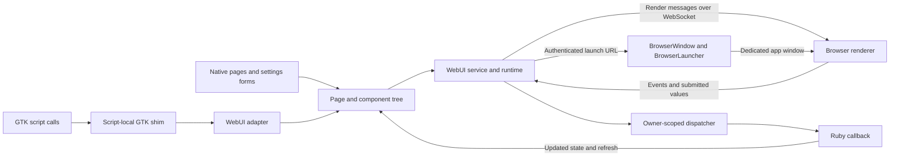

# WebUI architecture and integration

WebUI supplies the graphical launcher, native script interfaces, and a bounded
GTK compatibility layer. Both native and compatible GTK script interfaces use
the same component contract, renderer, and window lifecycle. Core WebUI is
independent of the compatibility layer and does not require the GTK gem.

## Rendering and event flow



The main responsibilities are:

| Layer | Responsibility | Source |
| --- | --- | --- |
| Author API | Register, render, open and close owner-scoped pages | [WebUI API](../lib/api/webui.rb), [WebUI facade](../lib/webui.rb) |
| Presentation | Build declarative component trees, forms and reusable compositions | [TreeBuilder](../lib/webui/tree_builder.rb), [SettingsForm](../lib/webui/settings_form.rb), [ListSettingsForm](../lib/webui/list_settings_form.rb) |
| Compatibility | Translate supported script-local GTK calls into the shared contract | [ScriptScope](../lib/common/script_scope.rb), [GTK shim](../lib/common/script_scope/gtk/) |
| Contract | Define and validate properties, events and child relationships | [Contract](../lib/webui/contract.rb), [Validator](../lib/webui/validator.rb) |
| Runtime | Register pages, track viewers, dispatch callbacks and manage modals | [Service](../lib/webui/service.rb), [Runtime](../lib/webui/runtime.rb) |
| Window host | Launch and monitor browser processes and retain window geometry | [BrowserWindow](../lib/webui/browser_window.rb), [BrowserLauncher](../lib/webui/browser_launcher.rb), [WindowGeometryStore](../lib/webui/window_geometry_store.rb) |
| Renderer | Paint shared controls and send user events and submissions | [JavaScript](../lib/webui/assets/app.js), [CSS](../lib/webui/assets/app.css) |

Scripts retain ownership of their calculations, defaults, ordering, persistence,
validation and cancellation behavior. Presentation helpers do not supply those
policies. Native consumers use WebUI directly; they do not pass through the shim.
The compatibility layer is a supported subset of GTK, not a complete GTK runtime.
Unsupported interfaces require a native conversion or a separately designed
contract extension.

### Script dependency boundary

`Script` activates the compatibility scope before evaluating either trusted or
label-based scripts. Within a running script, `require 'gtk2'` and
`require 'gtk3'` (including `.rb` spellings) resolve to that already-loaded shim
and return `false`. They never activate an installed native GTK gem. Supported
widgets still resolve lexically through `ScriptScope`; no global `Gtk` is added.

The plugin guards Ruby's `require`, `require_relative`, and `load`, including
explicit `Kernel` calls and calls in required helpers. Recognizable native GTK
subloads and GTK-stack dependencies are refused with script, operation, feature
and source attribution. Outside script ownership, even the GTK entrypoint aliases
are refused. Ordinary dependencies retain Ruby loading and relative-path behavior.
This process-wide dependency guard is installed by the script plugin; core WebUI
does not depend on the shim. It is not a sandbox against arbitrary Ruby, renamed
native binaries, or direct FFI calls. Native GTK loading, event loops, and fallback
are unsupported; installed GTK gems do not extend the compatibility contract.

### Script bindings and helpers

Each script binding has independent local variables. Trusted scripts evaluate
inside `Lich::Common::ScriptScope`: bare top-level methods and constants live in
that shared script scope, not on `Object` or `Lich::Common`. They are not isolated
per script. An absolute lookup such as `::MyHelper` does not find a script-scope
constant, and explicitly reopening a global class does not import script helpers.
Label-based scripts retain their own receiver for instance methods while sharing
the lexical constant boundary. This differs from the former global binding;
it is not a Ruby sandbox.

New script-owned nested classes and modules receive script helpers. For inherited
classes, real superclass methods take precedence and only declared public script
helpers are forwarded; the module's administrative methods are not forwarded to
instances. Assigning an existing core module or class to a script constant is an
alias, not permission to modify its ancestors or inject helpers into core objects.

Destroy callbacks run independently. A script error in one handler is logged and
does not skip later handlers or sibling-window cleanup. Fatal VM failures are not
treated as recoverable callback errors. Repeated destruction remains idempotent.

### Queued script work

`Gtk.queue` defers its block through `WebUI.callback_queue(owner:)`, which captures
the current host and submits to its existing owner dispatcher. It returns
`:queued` on admission, not the block result or a GLib timer ID. It returns `nil`
for ordinary work submitted during script teardown; a stopped host or full queue
refuses ordinary submissions.
The shim does not create an additional worker queue or a native event loop.

Accepted blocks execute sequentially in owner enqueue order alongside native UI
callbacks. They are not coalesced; a nested submission goes to the tail rather
than executing inline. Different owners run independently. No exact delay,
cross-script ordering, or browser-paint completion is promised. A block must not
wait for another callback on the same owner or synchronously await a modal;
use the existing asynchronous response callbacks instead.

The worker adopts the calling Script's ownership and respects its pause/stop
state. Legacy queue exceptions are reported without aborting later blocks.
Pending work is canceled on owner termination, and a retained queue handle
cannot restart a stopped host. Full dispatcher shutdown closes admission before
collecting workers, including owners that have not previously submitted work.

There is one cleanup exception: a `before_dying`/`Script.at_exit` handler may
call `Gtk.queue` on its existing session. Script has already stopped its ordinary
workers, so this block (including nested cleanup) executes inline under the shim
lock on that owner's cleanup thread and returns `:queued`. Existing scripts may
therefore queue their geometry reads/destruction and wait for completion without
deadlocking teardown. This does not reopen the dispatcher, create a session, or
allow unrelated late work. Closed sessions refuse all further submissions.
Compatibility failures retain their rejected class/operation in queue diagnostics;
arbitrary exception messages are not copied into those diagnostics.

The shim bounds progress fractions to the displayed 0–1 interval, including
infinite values. A NaN fraction retains the previous display value and emits one
compatibility notice per session because WebUI cannot transport NaN. Script
calculations are unchanged; native WebUI's numeric validation remains strict.

## Window hosting and lifecycle

On macOS, `BrowserLauncher` uses `OS.mac?` to select an AppKit window containing
Apple's WKWebView. Windows and Linux retain dedicated Chrome app windows,
with Edge also supported on Windows. An explicit browser executable
can still be supplied for browser comparisons. No Electron runtime is used.

The macOS helper runs as an accessory application (`LSUIElement` and AppKit's
accessory activation policy). Its windows remain interactive without adding
per-window application icons to the Dock or Cmd-Tab switcher. There is no
application menu bar; keyboard equivalents remain available inside the window.
Already-running helpers must be closed and reopened to adopt a changed build.
The helper and Ruby launcher must ship together: its first argument is a private
launch-file path, not an authenticated URL.

The experimental macOS helper is built with
`zsh lib/webui/native/macos/build.sh`. This requires Apple's installed command-line
developer tools and produces an ignored universal Intel/Apple Silicon app under
`lib/webui/native/macos/build/`, targeting macOS 14 or later. Normal launches never
compile or download anything. Distribution must supply this app; Developer ID
signing/notarization and testing on older macOS/physical Intel hardware remain
release work. The local build has only the linker's ad-hoc signature. A missing
helper is reported as a launch failure, rather than silently changing hosts.

On Windows, `WindowPresentation` uses `OS.windows?` and Ruby/Fiddle bindings to
`user32.dll` to apply topmost and whole-window opacity. No Windows helper build,
SDK, MSYS2 packages, or WebView2 runtime is needed for this approach. The Win32
mechanism follows [EO #1648](https://github.com/elanthia-online/lich-5/pull/1648).
Unlike its shared-profile title fallback (corrected by
[EO #1657](https://github.com/elanthia-online/lich-5/pull/1657)), this host discovers
only an unambiguous top-level Chromium window belonging to its isolated process.
Discovery is bounded and canceled on close. Each subsequent validated render
updates the same controller, which rechecks PID ownership before changing a
window. Native failures are logged. Actual Windows focus, opacity and cleanup
still require verification on Windows.

`Service` owns one `BrowserWindow` per registered page and one for the page selector
opened by `WebUI.open` without a page. Service shutdown closes both. Repeated opens
reuse that ownership. Chrome/Edge processes have isolated temporary
profiles; their exit monitors remove the profiles. The macOS helper uses a
nonpersistent WebKit data store. Closing one page acts
on its owned process, not the user's ordinary browser or another page's window.
These monitors run inside Lich. A forced process kill or fatal crash can leave
host windows and private temporary launch/profile directories behind; there is
no parent-death watchdog or startup cleanup sweep. Disconnected windows continue
retrying their connection. Normal script termination and game exit use the
owned-window cleanup path described above.

Geometry precedence is explicit caller geometry, then saved geometry where the
page does not own configure handling, then the page's default size and position.
The geometry store is scoped by game and character when that context is available.
Pages with configure handlers own their geometry policy; the host neither restores
nor saves their geometry. This includes shim windows, whose ephemeral page IDs
must not accumulate unused host geometry files. Script geometry reads and existing
script-owned persistence remain unchanged. Older unused files are not deleted.
Browser content dimensions and OS-window dimensions are distinct; programmatic
window positioning and resizing remain subject to browser and platform behavior.
The AppKit host maps `presentation(always_on_top: true)` to normal window level
plus one, without cycling focus. Setting it false restores normal level. On-top
windows stay above ordinary windows in the current Space and do not follow the
user to other desktops or another app's full-screen Space. Borderless
windows remain closable with Cmd-W. Windows uses
`SetWindowPos(HWND_TOPMOST/HWND_NOTOPMOST, ... SWP_NOACTIVATE)` for the same
request, preserving keyboard focus in the frontend. Alt-F4 closes its windows.
The shim retains `Gtk::Window#keep_above=`
in the page's presentation property, validated by the same schema as native
presentation facilities. The ten adapter operations are unchanged. Windows
Chrome/Edge still do not support the borderless request: Chromium draws its own
title bar. Linux retains the existing browser limitations.

The macOS host applies opacity with `NSWindow.alphaValue`; Windows uses
`SetLayeredWindowAttributes` with `LWA_ALPHA`. Native opacity affects the entire
OS window, not just its HTML content. The renderer suppresses its CSS fade when
the macOS bridge or the owned Windows host handles opacity, avoiding a second
multiplication. Other browser hosts retain their existing content-only fade.
An absent opacity request restores 100%; an absent topmost request restores
normal stacking. These properties do not alter a script's saved preferences.

The injected macOS bridge implements ordinary window resize/move operations
and supplies native outer dimensions and desktop coordinates to the existing
geometry reporters. Only the requested root controls the native window;
in-window dialogs cannot change its level or title. Navigation and native bridge
messages are limited to the original loopback origin and main frame. The helper
has no file-reading, shell-execution or arbitrary native-call bridge.

Owner termination first refuses new pages, windows and modals for that owner,
then cancels modals, revokes file routes, shuts down callback dispatch,
unregisters pages, and destroys viewer state. A restarted script has a new owner
identity. Completion-callback failures are logged without preventing remaining
callbacks or cleanup; full service shutdown also cancels pending modals. Explicit
window closure is distinguished from a temporary transport disconnect. Ordinary
disconnect retains a bounded 60-second resume window; repeated attachment to the
same page on an occupied connection is rejected.
An explicit detach closes the authenticated attachment even if a newer render
has overtaken the viewer, including an in-window modal without OS geometry.
This does not relax generation checks for component events or submissions.

Close and detach callbacks receive a temporary snapshot of the last validated
viewer state, so legacy close/save handlers can still read inputs after the live
attachment is removed. The shim commits those inputs before `delete_event`;
callback completion or cancellation releases the snapshot. An owned OS window
exiting without `pagehide` uses its sole retained viewer when available; it does
not guess among multiple viewers. This does not add unsupported GTK dialogs.
Outgoing frames similarly use one captured render and its viewer values, keeping
component IDs, bindings and generation consistent during concurrent refreshes.
Late refreshes cannot restore diagnostic records for unregistered pages.

Modals reapply their declared `no_viewer` policy when the last active viewer
leaves: `abort` cancels, `default` selects the declared response, and `wait`
remains pending. Resumable disconnected attachments are not active viewers.
There is no new user-response deadline. A settings form whose host cannot open
its window cancels immediately instead of leaving its script waiting.
The shim's supported informational OK dialog uses the existing wait policy so
opening it before the first viewer attaches does not silently cancel it. Parent
destruction or owner shutdown cancels that pending dialog; callback code still
must use its asynchronous response handler rather than blocking the dispatcher.

## Authentication and trust boundaries

The loopback service uses short-lived, single-use launch tokens to establish
port-specific HttpOnly, SameSite=Strict cookies. Launch tokens expire after
60 seconds. Treat launch URLs as credentials: do not log or share them. The
launcher passes a private temporary file path in process arguments; the file
contains the URL. On POSIX the directory is 0700 and file 0600; Windows relies on
the user's private temporary-directory ACL. Every browser gets an isolated
profile, even without an exit callback. The exit monitor removes launch files
and profiles; failed startup removes them too. Abrupt process or system failure
can leave temporary files, but unused launch tokens still expire.

Host and Fetch Metadata checks apply to requests. File-to-HTTP bootstrap is a
cross-site document navigation: `/auth` still requires a valid single-use token,
then commits a small same-origin document before navigating to the clean page
URL with its Strict cookie. Other routes retain the ordinary origin checks.
WebSocket admission also
requires an allowed loopback Origin. Image serving requires authentication,
permitted roots and extensions, and realpath containment.
File aliases are service-wide but owned: another owner cannot replace a live
alias. Its owner may update or revoke it; revocation permits later reuse. Root
containment handles filesystem roots and still excludes sibling-prefix paths and
symlink escapes. This ownership rule does not add per-viewer authorization.

Orderly WebSocket closure attempts a normal Close frame before retiring the socket.
Shutdown does not wait for a busy writer or append a Close frame inside a partial
message. Failed or canceled admitted writes retire their stream before another
writer can use it; abrupt/busy transport failures can therefore still appear as
an abnormal browser close and use the existing reconnect behavior.

At most 64 accepted HTTP/WebSocket sockets occupy request workers, including
clients that have not supplied complete headers. Excess sockets close before a
worker starts. Header reads retain their five-second timeout. This bounds
resource use; it does not guarantee availability against a sustained local flood.
Authentication redirects reject backslashes and ASCII whitespace/control bytes.
Markdown renders same-host links to another port or scheme as plain labels,
because cookies are host-scoped despite their port-specific names. External
HTTP(S) links and same-origin links remain available. This is renderer protection,
not general cookie isolation from a user manually navigating their browser.

An authenticated viewer is trusted across the entire WebUI service, including
registered pages from different owners and permitted image routes. Authentication
is not a per-page capability. Page addresses, owner labels, resume tokens and
saved-entry keys are not access-control boundaries. Owner identity determines
callback execution and cleanup, not isolation between authenticated viewers.
Page-scoped sharing would require a separate authorization design.

`WorkItem` owns callback cleanup through completion, exceptions, queue refusal,
replacement, eviction and cancellation. Cleanup occurs outside queue locks.
Canceling a running callback leaves cleanup with that callback until it exits.
Sensitive-value disposal reduces retention; it cannot guarantee erasure of every
copy Ruby or the operating system may have made.

The native launcher shares a close/write gate with frontend editing and
preference persistence. A close or viewer departure accepted before a write or
launch prevents that step; an admitted step finishes before close proceeds.
Authentication runs outside the gate and is not forcibly interrupted; credentials
returned after cancellation are discarded. The gate does not make account YAML
and keychain writes a single recoverable transaction.

## Launcher recovery and saved entries

An unreadable or malformed `entry.yaml` produces a visible recovery notice while
leaving Manual Entry available. Catalog writes are refused until the file is
repaired or restored; **Refresh Entries** then reloads it. An absent file, or an
empty, comment-only or YAML `null` document, is an empty catalog with Plaintext
as its default mode. Malformed YAML and invalid non-null structures are refused
rather than silently replaced with an empty catalog.
`EntryStore.write_yaml_file` publishes a complete temporary file by rename under
a stable sidecar lock. This prevents partial publication by callers using that
writer; it does not serialize a caller's entire read/modify/write transaction or
make YAML and keychain changes transactional.
On non-Windows hosts, the writer also syncs the containing directory after rename
to improve crash durability. A directory-sync failure is logged as uncertain
power-loss durability; the already-published file remains in use so callers do not
roll back matching encryption state. Windows skips this directory operation.

Creating Enhanced Encryption requires a nonempty password and a matching
confirmation, preserving GTK's creation policy. Switching to Plaintext requires
explicit acknowledgement that saved passwords will be stored without encryption.
Leaving Enhanced Encryption still validates the current master password. The
separate Change Master Password action retains its existing length requirement.

Saved Saga entries use `SagaManagedLauncher`: Saga owns authentication and starts
its Via-Lich session, so Lich does not request a game key first. Saga combined with
a Custom Launch command is refused. Supported frontends can be stored even when
not detected locally; availability is checked separately for launch. Saved order
is retained with AutoSort off, and AutoSort uses the existing entry-store sorter.
The Favorites panel retains its separate favorite-order display.
Saved entries without an explicit Custom Launch command recheck availability
before unlocking credentials or authenticating, and again after an unlock prompt.
An unavailable frontend produces an actionable notice without starting a session.
Explicit custom commands and configured custom frontends retain their launch
behavior; discovery is not a guarantee that a later process spawn will succeed.

A reconnectable viewer detach cancels that viewer's pending work and clears
retained manual credentials without closing the launcher. Explicit window close
and owned-process exit still perform shutdown.

Launcher feedback distinguishes saved-password unlocking, account authentication,
launch preparation and session launch. An account-authentication failure after a
successful unlock closes the unlock prompt and reports the authentication stage;
it does not imply that the master password was rejected. A wrong master password
still keeps the prompt available for retry or cancellation. Manual Entry reports
when a selected front end is no longer available, without changing its launch gate.

Startup failures and optional save failures use the existing `Lich.msgbox` notifier:
the Windows native message box, or terminal/debug-log reporting on other hosts.
A host process exiting before the first viewer attachment reports before releasing
the launch waiter. Every accepted close attempts to log its reason; reconnectable
detach is not a close. Notification and diagnostic failures cannot interrupt
closure or mask a startup error. Closure always signals the launch waiter, even
when teardown raises. Each teardown step and the close callback are attempted
before the first teardown or callback error propagates to the caller.
Optional save failure notification occurs after plaintext disposal
and outside the commit gate; login can proceed unless canceled, even if notification
fails. No GTK alert, fallback browser tab, or authentication URL is introduced.

## Theme behavior

`StartupTheme.apply` retains the application's existing `Lich.track_dark_mode`
preference, explicit `--dark-mode` override, and child-session propagation.
`WebUI::Theme.current` reads that preference without introducing another settings
store or selecting the operating system's theme. Standalone consumers without
Lich settings default to light mode.

Native pages and settings forms inherit the application preference unless they
explicitly request `theme: :light` or `:dark`. The shim's
`Gtk::Settings.default.gtk_application_prefer_dark_theme?` query reports the same
preference so script palette functions can retain their existing behavior.

The launcher persists preference changes through its catalog and refreshes
rendered pages. Viewer drafts survive the refresh. Shared menus, dialogs, tables,
disabled controls and progress troughs use the palette; explicit component
colors, fonts, dimensions and progress fractions retain their authority.
Compact layout metrics are shared by both themes. Script-specific styling belongs
in explicit presentation properties.

## Reusable presentation helpers

These helpers compose existing controls. They do not add persistence, validation,
sorting, default selection, or cancellation behavior.

| API | Purpose |
| --- | --- |
| `TreeBuilder#setup_footer` | Compose an italic notice and existing action; the caller supplies wording, spacing, wrapping and the action renderer. |
| `ListSettingsForm.text_list_spec` | Describe lazy single-column rows while retaining caller-owned value, Add and Delete callbacks. |
| `SettingsForm.choice_options` | Convert prepared strings to value/label records while preserving order, duplicates and blank choices. |

Within an existing `SettingsForm` layout, pass its `save` callable to retain the
form's submission scope:

```ruby
tree.setup_footer(
  notice: 'Your changes are saved automatically.', action: save,
  notice_props: { margin: { left: 10, top: 5, bottom: 5 } },
  action_props: { margin: { right: 10, top: 5, bottom: 5 }, min_width: 80 }
)
```

Use notice text that matches the script's behavior. `action:` renders the caller's
button; the helper itself does not save or close anything.

`text_list_spec(value:, add:, delete:, label: '', clear_after_add: false)` reads
current values on each render and passes mutation callbacks through unchanged.
It neither normalizes values nor swallows callback errors. `choice_options` does
not select a default or make duplicate values valid under the select contract;
choice preparation remains the caller's responsibility.

## Validation

### Source documentation

Ruby API documentation is generated with `yard doc` using the repository's
`.yardopts`; the output is `doc/yard/index.html`. Document the contracts of added
or changed methods: owner/viewer scope, return values, refusals, callback timing,
and resource disposal where relevant. Keep private-helper comments focused on
invariants that callers or maintainers cannot infer from the name alone.

The default `.yardopts` excludes private methods. See the
[YARD style guide](YARD-STYLE-GUIDE.md) for documentation tiers, private-method
documentation, examples, and coverage checks.

Renderer comments describe draft preservation, event replay, and measured layout;
the native host documents its origin checks and OS-window boundary. RSpec example
descriptions document tested behavior, while reusable fixture helpers explain
their ownership and limitations. Documentation coverage is a diagnostic, not a
substitute for accurate contracts.

### Runtime checks

For a short explicit desktop check, run `ruby bench/native_webui_smoke.rb`.
It opens an offline native page and shim window through the production host.
Toggle topmost and native-page opacity, type in the frontend, then close the
windows independently. This fixture does not replace actual Map/Spellson runs.

See the [test suite README](../spec/README.md) for Ruby and JavaScript commands
and test conventions. Ruby tests cover contracts, callbacks, lifecycle and
integration boundaries; the JavaScript suites cover renderer logic and DOM
behavior. The JavaScript suites run separately from RSpec.

Actual browser runs establish browser layout and interaction. Visual equivalence
requires comparison with the original GTK interface. Native geometry, focus,
restoration and independent-window cleanup require actual OS-window checks.
Mocks, jsdom, responsive viewports and browser-tab closure do not establish those
native behaviors. Game-connected behavior requires validation in a game session.
